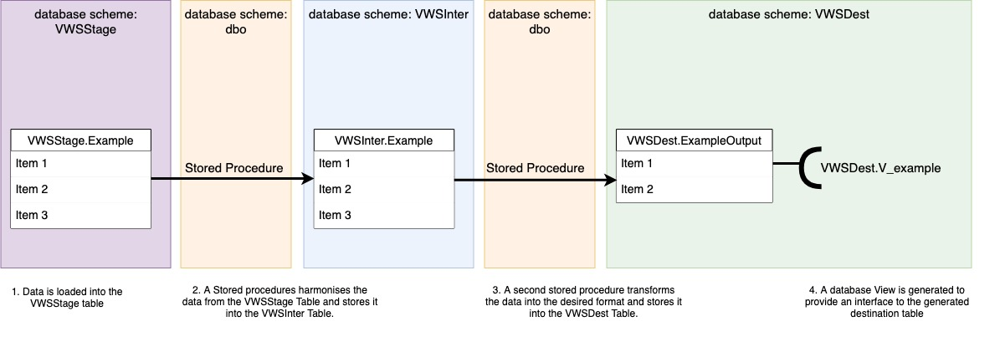
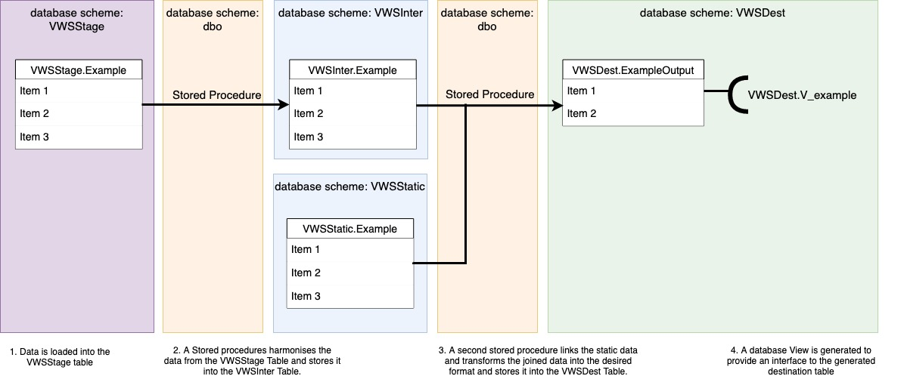

# Introduction
This is the technical documentation of the SQL module. 
The module was developed on a mssql database, so if another database is used some of the functionality might need adjustments.

# Datatino dependency
The project Datatino (and mainly the modules orchestrator and proto) are used for the scheduling-configuration and run-configuration of this project. That means that this project uses some tables from that project to store the project specific configuration in. The other tables, functions, stored procedures and data-imports within this project are specific for this project and only provide the basis for the transformation and calculations required to eventually form the output.

# DB-schemas

1. VWSSTAGE: drop location for new data. The data-schemes of this schema are equivalent to the data-schemes of the input-files. The columns are mostly of type varchar, to make sure the loading of data will less likely be a problem. 
2. VWSINTER: first harmonisation step of the new data. The column-names are often equal to the original input-files, but already some changes are made to the types (e.g. varchar to float) and data is trimmed, to prevent errors based on preceeding or tailing spaces. 
3. VWSDEST: this is the schema which holds the destination folder, which is the data from which the views read to create the data for the front-end.
4. DATATINO/DATATINO_ORCHESTRATOR/DATATINO_PROTO: these schemas are used for the configuration of the workflow orchestration and json file generation. The table creation files are available in the datatino-projects, this project requires those to already be available before importing the data during the flyway migration.
5. dbo: default schema where the functions and stored procedures are located.
6. TEST: this schema is only available in the test-phase and is thereby not available in the production environment. This schema holds the unit-tests and the utility stored procedures.
7. VWSSTATIC: this schema only contains static data, as the name implies, and contains data such as number of inhabitants or mapping of municipilaty codes to safety region codes.


## Normal data pipeline

About 90% of the currently defined data pipelines follows a standard flow, which is depicted in the figure below.



1. The data is loaded into the VWSStage tables.
2. A Stored procedures harmonises the data from the VWSStage Table and stores it into the VWSInter Table. These tables are in different database schemes, but have the same name.
3. A second stored procedure transforms the data into the desired format and stores it into the VWSDest Table. This table does not usually have the same name. 
4. A database View is generated to provide an interface to the generated destination table. If a filter is required on top of the standard logic, for instance a filter on the time-line required for the output, that filter is build in the view.

## Data Pipelines using static data

Some data pipelines require some static data to determine the desired insights, the default flow for these pipelines is depicted in the figure below.
N.B. an overview of all used static tables and the stored procedures reading them can be found here: [static-data documentation](./static_data_doc.md)



## Data Pipelines exceptions

Some of the currently defined data pipeline don't follow the standard flow. 
This can be due to one of the follow reasons:
1. Multiple VWSDest tables are created from one input data-source (and thereby one VWSStage and VWSInter table), eventhough in this set-up multiple 'second layer' stored procedures are required, the rest of the datapipeline is not impacted.
2. Multiple VWSInter tables are combined into one VWSDest table, this has impact on the second stored procedure, which now reads from multiple tables, but not on the rest.
3. Some pipelines, and this is the minority of the pipelines, skip the VWSInter table. These pipelines are so-called direct-copy pipelines, which means no logic is performed in the data-pipelines and the data is already delivered in the desired format. Therefor it is decided not to duplicate the data in an VWSInter table. 

# FLYWAY versioning

In this project a database versioning tool was used (Flyway). This tool creates the opportunity to store and keep track of the all changes made to your database based on a series of files and their version-numbers. In this project two different flyway types are used, the versioned-migrations and the repeated migrations. The versioned-migration files start with the letter V and a version number; The repeated-migration files start with the letter R and as there is no history kept in these files there is no version number added. 
- During every flyway migration, which is basically an update of the database, flyway checks whichs versions of the versioned migration files are already known to that version of the database. It checks this using a history table (stored in the first schema specified in the flyway-configuration). In the history table the version, the name and the checksum is saved. The addition of the checksum means that the versioned files should not be changed once they have been used for the update of the production-database as this will break the migration. If changes are required to the components created in one of the versioned scripts a new script should be added. 
- During every flyway migration all repeated scripts are executed again. No check is performed whether or not the script was already known to the database. This means the repeated migration files should include code which can be repeated multiple times (like create or alter procedure').

The versioned files have a fixed naming convention: V{version}.{schema-id}.{file-id}__{file-name}.sql

1. Versioning: the version of this specific sql-file
2. Schema-id: the reference to the DB-schema
3. File-id: the reference to the file

For installation and other tips and tricks go to 'https://flywaydb.org/'
For updating the database (from your local environment) of your choice:
1. Update the flyway.conf, by filling in:
    - the name of the server
    - the name of database
    - the name of db-user
    - the db-password
2. Run from the terminal (from the root of this project):
``` flyway migrate ``` as an alternative versioning is used it might be requird to add an 'outOfOrder'-flag.
3. This should result in an up to date database structure, the different data-pipelines are not triggered by this command.

Below you can find an example flyway configuration.

```
flyway.url=
flyway.user=
flyway.password=
flyway.baselineVersion=0.0.169
flyway.baselineDescription=Base Migration
flyway.baselineOnMigrate=true
flyway.schemas=VWS,\
               VWSARCHIVE, \
               VWSSTAGE, \
               VWSSTATIC, \
               VWSINTER, \
               VWSDEST, \
               VWSREPORT, \
               VWSMISC
flyway.locations= filesystem:main/sql/views,\
                  filesystem:main/sql/functions, \
                  filesystem:main/sql/tables/VWSARCHIVE, \
                  filesystem:main/sql/tables/VWSSTATIC, \
                  filesystem:main/sql/tables/VWSSTAGE, \
                  filesystem:main/sql/tables/VWSINTER, \
                  filesystem:main/sql/tables/VWSDEST, \
                  filesystem:main/sql/stored_procedures, \
                  filesystem:main/sql/stored_procedures/vwsdest, \
                  filesystem:main/sql/stored_procedures/vwsinter, \
                  filesystem:main/sql/stored_procedures/archive/vwsstage, \
                  filesystem:main/sql/stored_procedures/archive/vwsinter, \
                  filesystem:main/sql/indexes
```

## Error Handling

If any of the stored procedures encounters data which was not expected, the stored procedure will stop and will not continue producing data. The process triggering the stored procedure is responsible for the error-handling. If a human is triggering the stored procedure they should look into the errors, if datatino is used for the triggering of flows, the error-handling is integrated in the datatino-projects and notifications or warnings will be processed. 

### Dependencies
* Install [Flyway](https://flywaydb.org/documentation/commandline/): used for the database setup, see above explanation.
* Install [Docker](https://docs.docker.com/get-docker/): the tests are performed within a container to create a constant ready-to-use environment.

## Build and Run

1. Install your database engine and create a database (preferable SQL Server).

2. You can use the Dockerfile stated in the root folder to create a database as is used in this project. The Orchestrator and Proto projects are not yet published and thus not able to be cloned. Also, you will not be able to gather historical data from a database, so you would need to remove these statements from the bash script.

3. You are able to start loading/inserting the source data. Utilize the Datatino.Orchestrator project for this. This step will only insert the data into the database.

4. After the data was successfully loaded, you are able to generate the json files and place them on the file share. Execute Datatino.Proto for this.

## Adding new data

Check the [README](./main/sql/README.MD) for more information about adding sources and new data fields to the processing pipeline.